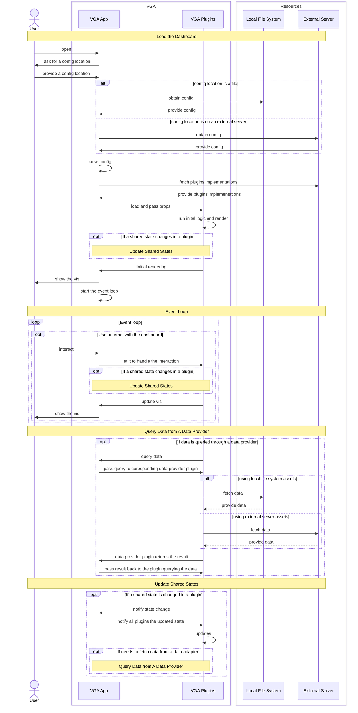

# VGA App

## Flow

```mermaid
sequenceDiagram
    %% define participants
    actor U as User

    box VGA
        participant APP as VGA App
        participant PLG as VGA Plugins
    end

    box Resources
        participant FS as Local File System
        participant ES as External Server
    end

    %% LOAD DASHBOARD
    Note over U,ES: Load the Dashboard

    %% open from a file or an URL
    U ->> APP: open
    APP ->> U: ask for a config location
    U ->> APP: provide a config location

    %% obtain config from local file system or external server
    alt config location is a file
        APP ->> FS: obtain config
        FS ->> APP: provide config
    else config location is on an external server
        APP ->> ES: obtain config
        ES ->> APP: provide config
    end

    %% VGA app to parse the config as JSON
    APP ->> APP: parse config

    %% VGA app to fetch plugin implementations from external servers
    APP ->> ES: fetch plugins implementations
    ES ->> APP: provide plugins implementations

    %% VGA plguin loads
    APP ->> PLG: load and pass props
    PLG ->> PLG: run inital logic and render

    %% handle potential state changes
    opt If a shared state changes in a plugin
        Note over PLG, APP: Update Shared States
    end

    %% finish rendering
    PLG ->> APP: initial rendering
    APP ->> U: show the vis
    APP ->> APP: start the event loop

    %% EVENT LOOP
    %% may want to put into another diagram
    Note over U,ES: Event Loop
    loop Event loop
        %% user interact with the dashboard
        opt User interact with the dashboard
            U ->> APP: interact
            APP ->> PLG: let it to handle the interaction

            %% handle potential state changes
            opt If a shared state changes in a plugin
                Note over PLG, APP: Update Shared States
            end
            
            PLG ->> APP: update vis
            APP ->> U: show the vis
        end
    end

    %% QUERY DATA
    %% may want to put into another diagram
    Note over U,ES: Query Data from A Data Provider
    opt If data is queried through a data provider
        PLG ->> APP: query data
        APP ->> PLG: pass query to coresponding data provider plugin
        alt using local file system assets
            PLG ->> FS: fetch data
            FS -->> PLG: provide data
        else using external server assets
            PLG ->> ES: fetch data
            ES -->> PLG: provide data
        end
        PLG ->> APP: data provider plugin returns the result
        APP ->> PLG: pass result back to the plugin querying the data
    end

    %% SHARED STATES UPDATED
    %% may want to put into another diagram
    Note over U,ES: Update Shared States
    opt If a shared state is changed in a plugin
        PLG ->> APP: notify state change
        APP ->> PLG: notify all plugins the updated state
        PLG ->> PLG: updates
        opt If needs to fetch data from a data adapter
            Note over PLG, APP: Query Data from A Data Provider
        end
    end

```
